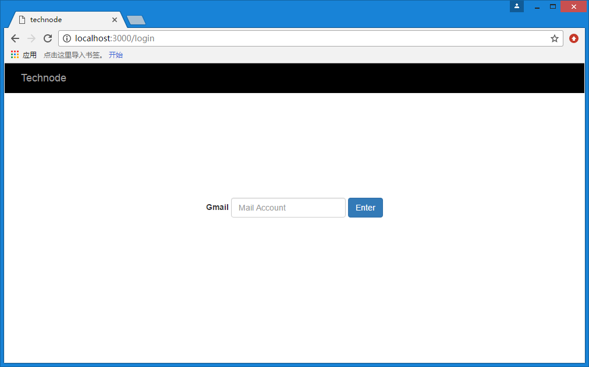
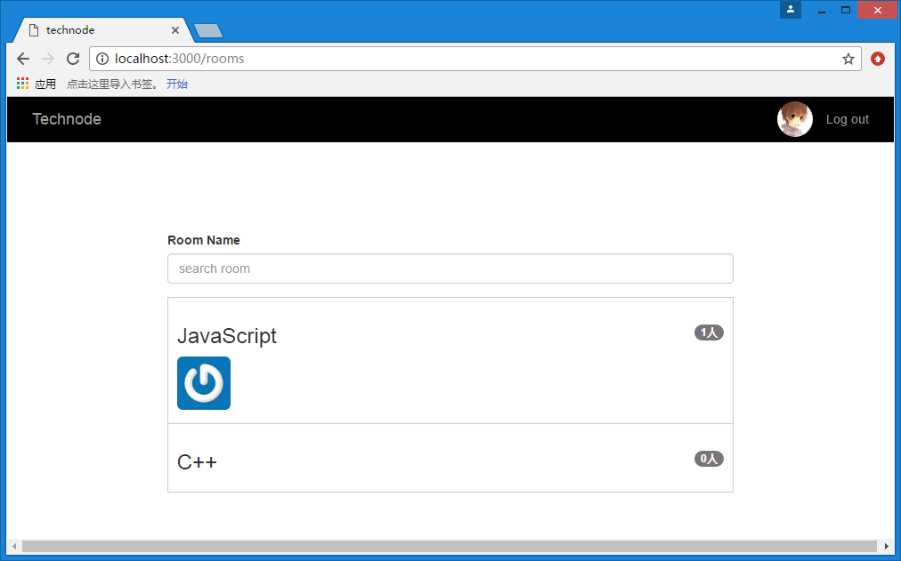
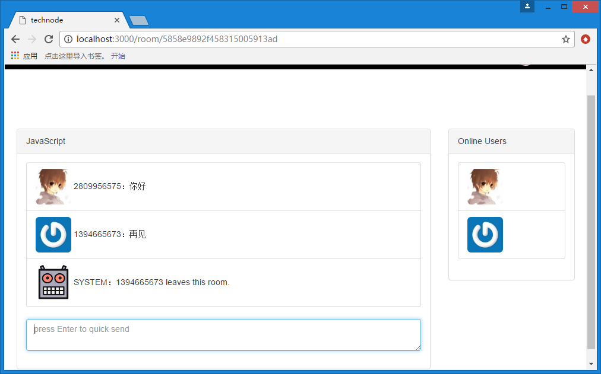

##technode

This is a simple web chat room based on single page application(**SPA**) using **Nodejs** + **socket.io**+**express**+**mongodb**，I am still working on it.Now have a quick look on what I have done.

###1.login page

###2.rooms page

###3.chating page 

